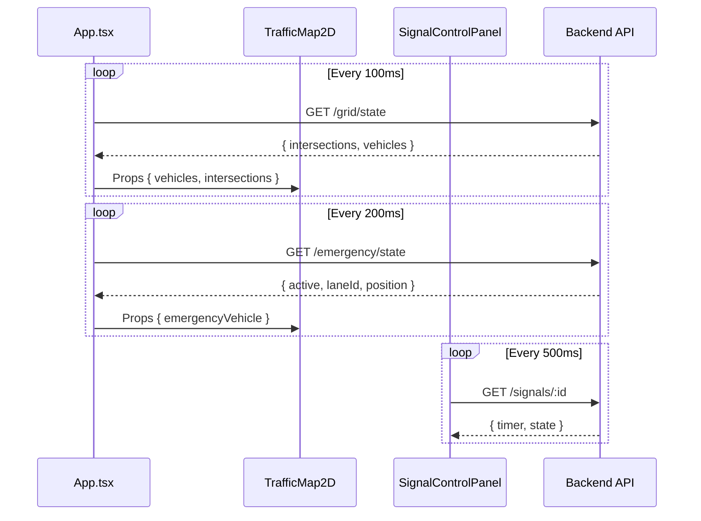

# SignalIQ Frontend Architecture Report

## 1. High-Level Architecture

SignalIQ follows a traditional Client-Server architecture where the frontend is a thin client visualization layer and the backend drives the simulation logic.

**Logical Diagram:**

```mermaid
graph TD
    User[User / Operator] -->|Interacts| Frontend[React Frontend (Vite)]
    Frontend -->|Polls State (100ms)| Backend[Simulation Backend (API)]
    Frontend -->|Sends Commands| Backend
    Backend -->|Computes Physics| SimulationEngine
    Backend -->|Computes ML| MLEngine
```

**Key Components:**
*   **Frontend**: React (Vite), TailwindCSS, React-Konva (Canvas), Recharts.
*   **Communication**: HTTP Polling (REST API). No WebSockets.
*   **State Management**: Decentralized React `useState` / `useEffect`.

## 2. Data Flow Architecture

The application relies heavily on **interval-based polling** to synchronize state between the backend simulation and the frontend visualization.

**Data Flow Diagram:**



**Analysis:**
*   **Polling Storm**: Multiple components (`App`, `SignalControlPanel`, `AIDecisionPanel`, `LiveMapView`) initiate their own polling intervals. This creates a "thundering herd" of requests, potentially saturating the network or browser main thread.
*   **Decentralized State**: Data is fetched and stored in local component state. There is no global store (Redux/Context), leading to potential inconsistencies (e.g., `App` thinks signal is GREEN, `SignalControlPanel` thinks it's RED).

## 3. Agent Lifecycle & Logic

Agents (Vehicles, Signals) are simulated entirely on the backend. The frontend is a **passive renderer** with interpolation.

1.  **Creation**: Backend spawns vehicles based on simulation rules.
2.  **Synchronization**: Frontend receives a snapshot of all vehicles (ID, position, speed, lane) every 100ms.
3.  **Interpolation**: `useVehicleAnimation.ts` calculates intermediate positions between snapshots to create smooth movement (60fps).
    *   *Risk*: If network latency > 100ms, vehicles may "jump" or jitter.
4.  **Regulation**:
    *   **Backend**: Enforces traffic rules (stopping at red lights).
    *   **Frontend**: `useVehicleAnimation` implements a *visual-only* "Red Light Enforcement" clamp to prevent rendering vehicles inside intersections during lag.

## 4. Map Rendering Pipeline

There are two distinct map rendering implementations, indicating code duplication and divergence:

1.  **TrafficMap2D.tsx (Operational View)**:
    *   Uses `react-konva` (Canvas).
    *   Renders a 5x5 Grid.
    *   **Hardcoded Logic**: Positions are calculated using fixed `roadWidth`, `lanePadding` relative to canvas dimensions.
    *   **Agent Rendering**: Iterates over `displayVehicles` and draws rectangles/circles.

2.  **LiveMapView.tsx (Dashboard View)**:
    *   Also uses `react-konva`.
    *   Re-implements grid drawing logic with different styling.
    *   Fetches `/grid/overview` instead of `/grid/state`.
    *   **Discrepancy**: Visuals might not match `TrafficMap2D` exactly if backend data models differ.

## 5. State Mutation Flow

State changes (Commands) follow a simple REST pattern:

1.  **User Action**: Click "Apply AI" or adjust slider.
2.  **API Call**: `POST /api/signals/update` or `POST /api/emergency/start`.
3.  **Optimistic UI**: Some components update local state immediately (e.g., Toggle switches).
4.  **Consistency Check**: The next polling cycle overwrites local state with server state.
    *   *Issue*: If the server rejects the command or lags, the UI might flicker (On -> Off -> On).

## 6. Technical Debt & Scaling Risks

### A. Critical Risks
*   **Race Conditions**:
    *   `SignalControlPanel` reads `nsGreenTime` from state. If a user drags the slider, multiple API calls may fire. If the polling interval returns *old* data before the *new* write is processed, the slider will jump back, frustrating the user.
*   **Performance Bottlenecks**:
    *   `useVehicleAnimation` loops through *all* vehicles every frame. $O(N)$ where $N$ is vehicle count. For 1000+ vehicles, this will block the main thread.
    *   Canvas re-rendering: React-Konva is efficient, but full re-renders of the vehicle layer on every frame (due to prop updates) can be costly.

### B. Structural Debt
*   **Hardcoded Topology**: The 5x5 grid assumption is baked into `TrafficMap2D` and `App`. Adding a 6th road or a curved road requires rewriting the entire rendering logic.
*   **Prop Drilling**: `intersections` and `vehicles` are passed down 3-4 levels.
*   **Component Coupling**: `App.tsx` contains too much logic (fetching, state holding, layout).

## 7. Specific Analysis: Agent Regulation & Control

*   **Regulation**: Centralized in Backend. Frontend has no authority, only prediction/interpolation.
*   **Command Issuance**: HTTP POST. No queuing or acknowledgement mechanism beyond HTTP 200 OK.
*   **Control Model**:
    *   **Decentralized**: Agents (Vehicles) are autonomous objects in the backend.
    *   **Centralized**: Signals are controlled by a central controller (or user override).
*   **Async Risks**:
    *   **Split-Brain**: User enables "Emergency Mode" in `EmergencyCard`. The request takes 200ms. Meanwhile, `App` polls `emergency/state` and sees `active: false`. The UI might briefly show "Active", then "Inactive", then "Active".
